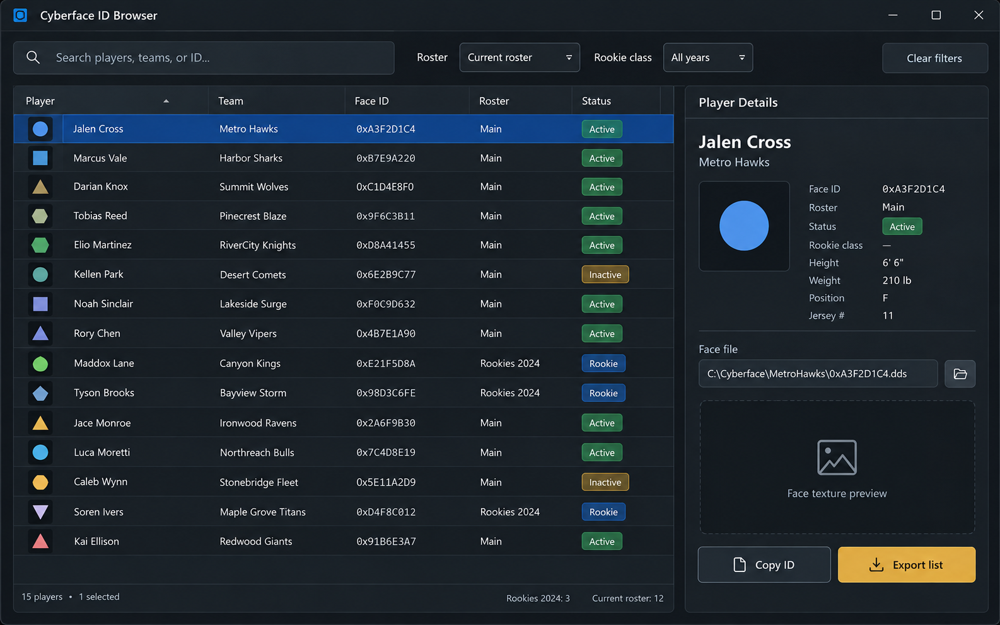

# NBA 2K27: lista de Cyberface IDs

Consulte IDs de rostos por jogador e elenco. Confira a origem de cada registro para não misturar dados de versões anteriores.

<a href="./README.md">English</a> · <a href="./README_ES.md">Español</a> · <a href="./README_PT.md">Português</a> · <a href="./README_DE.md">Deutsch</a> · <a href="./README_FR.md">Français</a> · <a href="./README_CN.md">简&#8288;体&#8288;中&#8288;文</a> · <a href="./README_TW.md">繁&#8288;體&#8288;中&#8288;文</a> · <a href="./README_JP.md">日&#8288;本&#8288;語</a> · <a href="./README_KR.md">한&#8288;국&#8288;어</a>

  

## Por que esta ferramenta existe

O trabalho do Cyberface geralmente começa com o nome do jogador e termina com um ID, caminho da pasta e verificação de escalação. O navegador mantém essas etapas em um só lugar e permite que os modders exportem apenas os registros relevantes para a lista que estão editando.

## Primeira execução completa

1. Abra **NBA 2K27: lista de Cyberface IDs** e confira a build ou a fonte de dados de NBA 2K27.
2. Escolha a entrada ou o perfil e ajuste **índice de ID do jogador pesquisável** sem alterar os padrões que não fazem parte do teste.
3. Confira **filtros de novato e escalação** na prévia ou no painel de status e corrija alertas de versão, filtro ou detecção.
4. Execute uma ação controlada. Compare o resultado visível com a prévia antes de mudar outro ajuste.
5. Salve o perfil ou exporte o resultado, mantendo **pasta mod e notas de exportação** disponível para comparação e recuperação.

## Antes de começar

- Deixe **Filtros de jogador ou escalação** pronto e confirme que pertence ao perfil ou sessão de NBA 2K27 desejado.
- Anote a build atual do jogo/cliente ou a data dos dados antes de alterar um perfil.
- Escolha onde **CSV ou ID copiado** será salvo para não substituir o resultado anterior.
- Teste **índice de ID do jogador pesquisável** primeiro em uma sessão curta e mantenha o save, perfil ou comparação original ao lado.

## Conheça a interface

- **01.** Pesquisa de lista com filtros de equipe, classe e status.
- **02.** Tabela de jogadores com ID cyberface e fonte de escalação.
- **03.** Visualização do registro selecionado com o caminho do arquivo de destino.
- **04.** Ação de copiar ID para um jogador sem exportar a tabela completa.
- **05.** Exportação filtrada para um projeto mod ou atualização de lista.

## O que ele faz

- **índice de ID do jogador pesquisável.** Pesquisa nomes e IDs de jogadores sem forçar uma correspondência ortográfica exata.

- **filtros de novato e escalação.** Restringe a tabela por escalação, equipe, classe ou status de registro.

- **pasta mod e notas de exportação.** Copia um ID limpo ou exporta os registros atualmente filtrados.

## Visão rápida

| Recurso | Resultado |
|---|---|
| **Entrada** | Filtros de jogador ou escalação |
| **Resultado** | Registro de identificação verificado |
| **Saída** | CSV ou ID copiado |

## Como interpretar o resultado

Use o ID junto com a origem e o status da lista. Um nome de jogador correspondente não é suficiente quando escalações personalizadas reutilizam registros ou movem jogadores entre equipes. Exporte a tabela filtrada somente após abrir um registro de amostra e verificar a pasta de destino esperada pelo mod.

## Solução de problemas

> **Falha comum:** um cyberface carrega no jogador errado.

### O jogador errado recebe uma cara

Verifique a fonte da escalação e o ID do jogador juntos; nomes duplicados podem existir em conjuntos de listas.

### Falta um jogador

Remova os filtros de equipe e de novato e atualize os dados da escalação selecionada.

### O caminho exportado está errado

Revise a raiz da pasta mod no registro selecionado antes de copiar ou exportar IDs.

## Dados e recuperação

O banco de dados não precisa alterar os arquivos de lista. Exporte IDs filtrados para um espaço de trabalho de mod separado e mantenha o rótulo da lista de origem com a exportação.

Use automação e modificações apenas quando as regras do jogo e o tipo de sessão permitirem.

## Depois de uma atualização do jogo

- [ ] Atualize a fonte da lista e anote sua data ou versão.
- [ ] Procure um jogador conhecido para confirmar se os IDs e as equipes ainda estão alinhados.
- [ ] Reaplique os filtros de escalação, novato e status após a atualização.
- [ ] Crie uma nova exportação em vez de substituir a última lista de ID verificada.

## Perguntas frequentes

<strong>Posso exportar a lista de IDs filtrados?</strong>

Sim. Aplique filtros de escalação ou de novato e, em seguida, exporte os registros visíveis ou copie um ID do inspetor de jogadores.

<strong>O que incluir no registro de compatibilidade?</strong>

Anote a versão exata do jogo e da ferramenta ou dados, a entrada usada e o resultado observado. Identifique campos desconhecidos; um teste em outra versão não comprova a atual.

<strong>Há um executável ou script funcional incluído?</strong>

O repositório contém documentação e um conceito de interface, não uma versão funcional verificada. Notas e imagens não são testes de execução nem comprovam autoria oficial, compatibilidade ou proteção da conta.

## Feito para

- Encontre um ID de jogador
- Filtrar uma atualização de lista
- Prepare uma exportação de pasta mod

---

## Baixar

Confira o escopo e a compatibilidade documentados antes de escolher uma versão.

---

Conceito de interface gerado por IA; uma versão funcional ainda não foi verificada.

